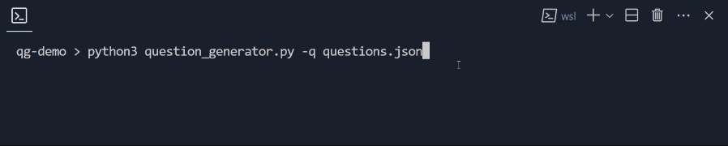

# Questions Generator

## How to run 

### CLI version

## How to insert your questions

## Demo

## Dependencies

- `rich` *(used for CLI affordance)*
- `pandas` *(used for CSV)*
- `random` *(built-in module)*
- `os` *(built-in module)*
- `sys` *(built-in module)*
- `argparse` *(built-in module)*

# Author

*Emilio Garzia, 2024*
